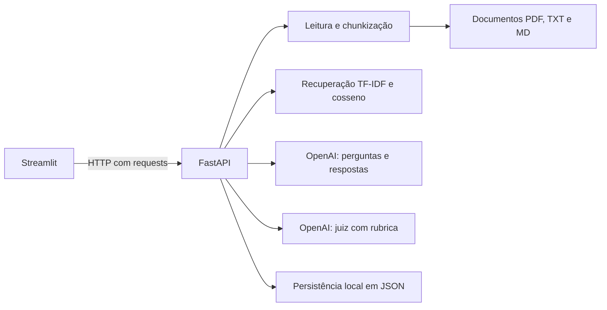

# RAG Avalia

Checkpoint integrado de **IA Generativa e Front-end — 2TIAPF (Manhã)**. Aplicação com FastAPI e Streamlit para construir uma base documental, gerar perguntas sintéticas, executar um pipeline RAG e avaliar suas respostas por LLM-as-a-Judge, sem ground truth.

## Integrantes

| Integrante | RM |
|---|---|
| Lucca Phelipe Masini | 564121 |
| Luiz Henrique Poss | 56217 |
| Igor Paixão Sarak | 563726 |
| Bernardo Braga Perobeli | 562468 |
| Felipe Stefani Honorato | 563380 |

## Execução local

Requisitos: Python 3.11 ou superior, Git e uma chave de API OpenAI com acesso ao modelo configurado e saldo disponível. As chamadas à LLM podem gerar cobrança pelo provedor. A chave fica exclusivamente no `.env` local e não deve ser enviada ao GitHub.

```bash
git clone https://github.com/betitanx/rag-avalia.git
cd rag-avalia
python -m venv .venv
```

No Windows (PowerShell):

```powershell
.venv\Scripts\Activate.ps1
python -m pip install -r requirements.txt
Copy-Item .env.example .env
```

No Linux ou macOS:

```bash
source .venv/bin/activate
python -m pip install -r requirements.txt
cp .env.example .env
```

Edite `.env` e preencha `LLM_API_KEY`. O modelo padrão é `gpt-4o-mini`; `LLM_MODEL` define o gerador e `LLM_JUDGE_MODEL` define o avaliador. `LLM_BASE_URL` é `https://api.openai.com/v1`. É possível usar outro provedor compatível com Chat Completions, desde que o modelo suporte JSON e o parâmetro `temperature`.

Inicie o back-end na raiz do projeto:

```bash
python -m uvicorn backend.main:app --host 127.0.0.1 --port 8000
```

Em outro terminal, ative o mesmo ambiente virtual e inicie o front-end, também na raiz:

```bash
python -m streamlit run frontend/app.py --server.address 127.0.0.1
```

- Interface: [localhost:8501](http://localhost:8501)
- Documentação interativa da API: [localhost:8000/docs](http://localhost:8000/docs)
- Verificação da API: [localhost:8000/saude](http://localhost:8000/saude)

Se o PowerShell impedir a ativação, use diretamente `.venv\Scripts\python.exe` no lugar de `python` em todos os comandos. Não é necessário alterar a política de execução.

## Como usar

1. Coloque arquivos `.pdf`, `.txt` ou `.md` em `backend/documentos/`. Dois documentos de exemplo já estão incluídos. Arquivos de texto devem usar UTF-8; PDFs precisam conter texto selecionável.
2. Em **Documentos**, ajuste o tamanho e a sobreposição dos chunks e clique em **Processar documentos**. Expanda cada documento para visualizar seus chunks.
3. Opcionalmente, ative **Utilizar personas**, informe uma persona por linha e clique em **Salvar personas**. Desative e salve para gerar sem personas.
4. Em **Dataset e RAG**, escolha a quantidade de perguntas e clique em **Gerar dataset**. As perguntas são criadas pela LLM a partir dos chunks reais.
5. Clique em **Executar perguntas no RAG**. As respostas aparecem abaixo das respectivas perguntas na mesma aba, com os contextos recuperados em uma seção expansível. A recuperação usa a pergunta gerada para buscar contextos, sem forçar o chunk de origem entre os resultados.
6. Em **Avaliação**, clique em **Avaliar respostas**. Veja médias, notas por pergunta e justificativas. Exporte o conjunto pelo botão **Baixar resultados em JSON**.

Reprocessar documentos apaga o dataset anterior. Gerar um dataset substitui o anterior. Executar novamente o RAG invalida as notas antigas. As operações são gravadas apenas ao concluir a etapa com sucesso; falhas preservam o estado anterior. Chamadas já feitas ao provedor durante uma etapa que falhou podem ter sido cobradas.

## Arquitetura



O front-end não importa módulos do back-end nem acessa seus arquivos de dados. Toda a comunicação acontece por requisições HTTP usando `requests`. A API recebe configurações validadas com Pydantic e coordena o pipeline.

| Caminho | Responsabilidade |
|---|---|
| `backend/main.py` | Endpoints e ordem das etapas |
| `backend/documentos.py` | Leitura, chunks por palavras com sobreposição e busca TF-IDF |
| `backend/llm.py` | Prompts, integração OpenAI e validação das respostas JSON |
| `backend/armazenamento.py` | Escrita atômica do estado em `backend/dados/estado.json` |
| `backend/documentos/` | Documentos da base de conhecimento |
| `frontend/app.py` | Interface Streamlit |
| `frontend/cliente.py` | Cliente HTTP, mensagens de erro e tempos limites |
| `scripts/consumir_api.py` | Exemplo independente de consumo de todo o fluxo por requests |
| `tests/` | Testes de chunkização, recuperação, API e cliente LLM |

### Pacotes

| Pacote | Uso |
|---|---|
| FastAPI e Uvicorn | API e servidor ASGI |
| Pydantic | Validação dos parâmetros e das respostas da LLM |
| pypdf | Extração de texto dos PDFs |
| scikit-learn | Vetorização TF-IDF e similaridade de cosseno |
| requests | Requisições do front-end à API e do back-end à OpenAI |
| python-dotenv | Configuração local por `.env` |
| Streamlit | Interface de consulta e avaliação |
| pytest e httpx | Testes automatizados e cliente de testes FastAPI |

`requirements.txt` instala as dependências dos dois projetos. Também é possível instalar `backend/requirements.txt` e `frontend/requirements.txt` separadamente em ambientes independentes; nesse caso, configure `API_URL` no ambiente do front-end e as variáveis `LLM_*` apenas no back-end.

Para reproduzir as versões exatas validadas em Python 3.13, use `python -m pip install -r requirements-lock.txt`. Esse arquivo também inclui as dependências de testes.

## Endpoints

| Método | Rota | Função |
|---|---|---|
| GET | `/saude` | Estado da API, modelos e presença da configuração da LLM |
| POST | `/documentos/processar` | Processar documentos; corpo: `{"tamanho":120,"sobreposicao":20}` |
| GET | `/documentos` | Contagem de documentos e chunks |
| GET | `/documentos/{documento_id}/chunks` | Conteúdo e identificadores dos chunks |
| POST | `/personas` | Configurar perfis; corpo: `{"personas":[]}` para desativar |
| POST | `/dataset/gerar` | Gerar perguntas; corpo: `{"quantidade":5}` |
| POST | `/rag/executar` | Recuperar e responder; corpo: `{"top_k":3}` |
| POST | `/avaliacao/executar` | Avaliar respostas com LLM-as-a-Judge |
| GET | `/avaliacao/resultados` | Notas individuais, justificativas e médias |
| GET | `/dataset` | Perguntas, personas, fontes, contextos, respostas e métricas |

Com a API iniciada e a LLM configurada, o script abaixo executa as etapas por HTTP e imprime o resultado. Ele substitui o dataset atual e realiza nove chamadas à LLM para três perguntas:

```bash
python scripts/consumir_api.py
```

## Avaliação sem ground truth

O juiz recebe apenas a pergunta, os contextos recuperados e a resposta. Não há resposta humana de referência. Cada métrica recebe uma nota entre **0 e 1**, validada por Pydantic, e uma justificativa textual.

| Métrica exigida | Critério |
|---|---|
| Faithfulness — Fidelidade | Quanto das afirmações verificáveis está sustentado nos contextos |
| Answer Relevancy — Relevância da resposta | Quanto a resposta atende diretamente à pergunta |
| Context Utilization — Utilização do contexto | Quanto das informações relevantes dos contextos foi usado na resposta |

O prompt define âncoras para as notas e tratamento de ausência de evidência. Uma recusa correta sem afirmações não sustentadas pode ter fidelidade alta; isso não significa que respondeu à pergunta. Sem informação relevante nos contextos, a utilização recebe zero e o motivo deve constar da justificativa. As notas são estimativas da LLM, não métricas determinísticas nem implementação oficial do RAGAS. Um juiz diferente pode produzir outras notas.

O dataset persiste identificadores das fontes, contextos efetivamente recuperados, similaridades, resposta, persona opcional, modelos utilizados, datas e métricas. O chunk de origem da pergunta serve para rastreabilidade; ele não é um gabarito e não é passado ao juiz separadamente.

## Testes

```bash
python -m pip install -r requirements-dev.txt
python -m pytest -q
```

Os testes substituem a LLM por respostas controladas para validar o contrato sem custo ou chave. Esses resultados simulados não são apresentados como avaliação real do sistema. Para validar a integração com a OpenAI, execute o fluxo da interface ou `scripts/consumir_api.py` com sua chave.

## Limitações

- A recuperação lexical pode não reconhecer sinônimos e não usa embeddings semânticos.
- PDFs digitalizados sem texto precisam passar por OCR antes de entrar na base.
- Há uma sessão compartilhada, persistida em JSON. Execute apenas **um processo Uvicorn**, sem múltiplos workers. O bloqueio impede duas etapas de escrita simultâneas nesse processo.
- As etapas são síncronas, limitadas a vinte perguntas. Uma execução completa faz três chamadas de LLM por pergunta. Comece com três perguntas para a demonstração.
- A aplicação foi desenhada para execução local, sem autenticação, conforme o escopo do checkpoint.
- Os documentos usados no pipeline são enviados ao provedor configurado nas etapas de geração, resposta e avaliação.

## Demonstração em vídeo

**[Assistir ou baixar o vídeo de demonstração (MP4, 2min09s)](https://github.com/betitanx/rag-avalia/raw/refs/heads/main/docs/demonstracao.mp4)**

O vídeo apresenta o fluxo e os resultados reais de uma execução com OpenAI, exportados pela API. É uma apresentação dos dados, não uma captura contínua da interface. O [JSON da execução real](docs/resultado-real.json) permite conferir perguntas, contextos, respostas e justificativas. Há também um [roteiro para gravação da interface](docs/roteiro-video.md).

### Validação realizada

- Dez testes automatizados aprovados, incluindo renderização da interface Streamlit.
- Fluxo real acionado pela interface: dois documentos, sete chunks e três perguntas geradas e respondidas por `gpt-4o-mini`.
- Avaliação real por `gpt-4o-mini`, com justificativas para as três métricas e médias de 1,00 nessa execução. Esse conjunto pequeno não comprova desempenho geral do sistema.
- Conferência no navegador das perguntas, respostas, contextos recuperados e justificativas, sem erros no console na verificação final.
- Dois avisos de descontinuação de dependências transitivas surgiram nos testes (Starlette/httpx e AnyIO), sem falhas.

## Referências

- [FastAPI: corpos de requisição](https://fastapi.tiangolo.com/tutorial/body/)
- [Streamlit: tabelas](https://docs.streamlit.io/develop/concepts/design/dataframes)
- [OpenAI: respostas estruturadas e modo JSON](https://developers.openai.com/api/docs/guides/structured-outputs)
